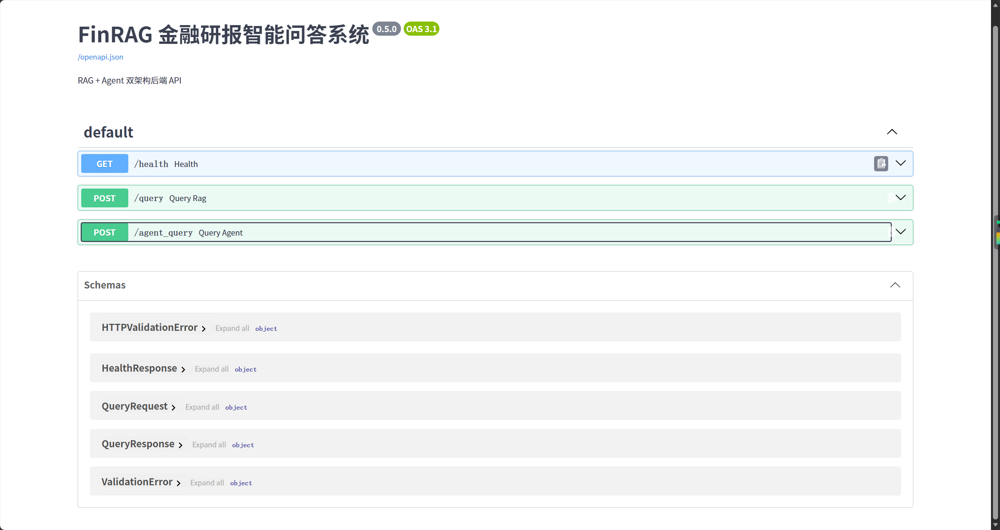
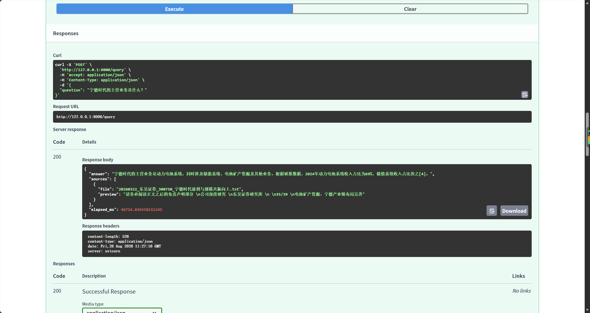
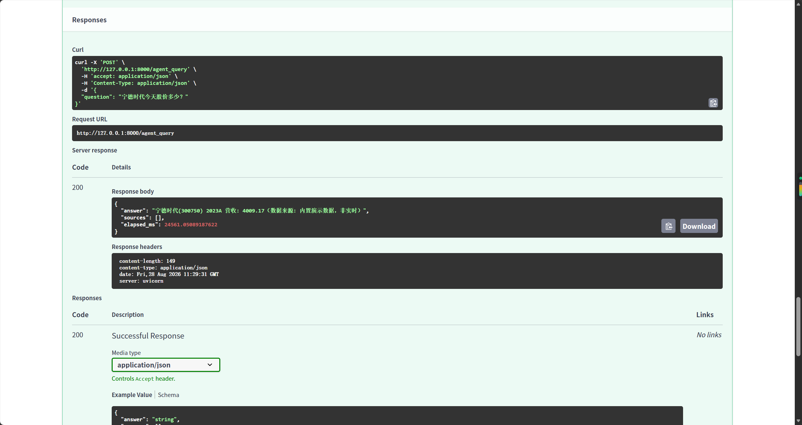
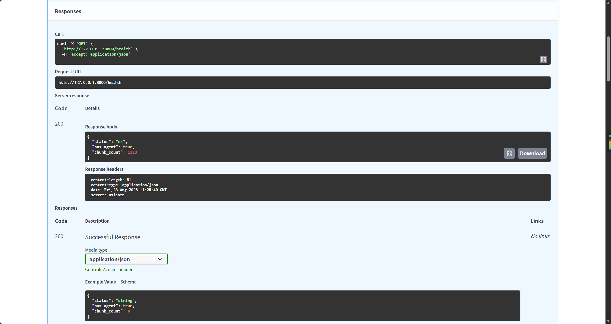

# FinRAG — 金融研报智能问答系统（v3.1 双通道版）

基于 **RAG（检索增强生成）+ Agent（工具调用）** 双能驱动架构的金融研报智能问答系统，
支持 **DeepSeek API / 本地 Qwen2.5-7B INT4 双通道切换**。系统对券商研报内容进行精准问答，
支持数值推理与引用溯源，并可调用工具查询实时行情与财务数据，实现"研报预测 vs 实际数据"综合对比。

> 项目定位：一个项目打穿 RAG + Agent + 量化评估（RAGAS）+ 工程部署全链路。
> 双通道 71 题 RAGAS 评估已定稿（v1.1.0），评测报告见 [docs/双通道对比报告.md](docs/双通道对比报告.md) 与 [docs/消融实验汇总表.md](docs/消融实验汇总表.md)。

## 核心特性

- **RAG + Agent 双能驱动**：研报问答走 RAG（严格忠于原文），实时数据走 Agent 工具，混合问题协同对比
- **双模型双通道**：`FINRAG_MODEL_MODE=api|local` 一键切换 DeepSeek 云端 / 本地 Qwen2.5-7B（Ollama，INT4 量化，RTX 4060 8G 可跑）
- **智能问答**：基于检索内容的精准回答，从根本上抑制大模型幻觉
- **引用溯源**：每条答案标注来源研报与段落编号，可解释、可验证
- **数值推理**：Few-Shot 引导，财务表格数据自动提取与计算
- **Agent 工具调用**：LLM 自主决定调 `get_stock_price` / `get_financial_data`
- **多轮对话**：滑动窗口记忆 + 追问增强（"那毛利率呢"自动接上文）
- **四级降级**：腾讯直连 → 新浪直连 → akshare → 本地演示数据（多源兜底，网络波动不崩溃）

## 技术栈

| 类别 | 选型 | 状态 |
|---|---|---|
| 语言 | Python 3.11 | ✅ |
| 大模型（云端） | DeepSeek（deepseek-chat API） | ✅ |
| 大模型（本地） | Qwen2.5-7B INT4（Ollama） | ✅ 双通道切换 |
| 模型调度 | 环境变量 `FINRAG_MODEL_MODE`（api / local） | ✅ |
| 框架 | LangChain 0.3+（LCEL 语法） | ✅ |
| 向量库 | ChromaDB | ✅ |
| Embedding | bge-large-zh-v1.5（1024 维） | ✅ |
| Reranker | bge-reranker-large（二次排序） | ✅ |
| Agent | DeepSeek Function Calling（OpenAI 兼容协议） | ✅ |
| 数据接口 | akshare（股价/财务，三级降级） | ✅ |
| 前端 | Gradio（对话 + 引用 + 工具可视化） | ✅ |
| 后端 | FastAPI（/health /query /agent_query + Swagger） | ✅ |
| 评估 | RAGAS（71 题双通道，judge=DeepSeek 中立） | ✅ |
| 部署 | Docker（Dockerfile + compose） | ✅ 文件已备 |

## 当前进展

### ✅ 已完成（第 1-5 周）

| 阶段 | 内容 | 关键结果 |
|---|---|---|
| Day 1-5 | 项目规划 / 环境搭建 / DeepSeek 接入 | 环境跑通 |
| Day 6-10 | 数据采集（20 份研报）/ 分块（1323 块）/ 向量化入库 | 知识库建成 |
| Day 11-12 | RAG 核心管线 v0.1（检索+上下文+生成） | 端到端跑通 |
| Day 13-14 | Prompt 工程 A/B 测试，ask.py v0.2 | P3 胜出（+48.6%） |
| Day 15 | 引用溯源增强 v0.3 | 编号引用+验证 |
| Day 16-17 | 数值推理增强（Few-Shot）v0.4 | 评测集准确率 **70%** |
| Day 18 | 检索质量优化 v0.5 | Hit Rate **100%**，混合+重排 MRR **1.000** |
| Day 19-20 | 多轮对话 v0.6 + 端到端测试 | 8-9/9 通过 |
| Day 21-22 | Agent 工具调用（股价查询） | LLM 自主调工具 ✅ |
| Day 23-24 | RAG + Agent 协同 v0.4 | 路由 + 综合推理跑通 |
| Day 25 | 协同版检索验证 + 路由准确率 | Hit Rate **100%**，路由准确率 **100%** |
| Day 26 | 协同版多轮对话 + 异常处理 + 端到端测试 | 5 轮追问不跑题 |
| Day 27-28 | RAGAS 量化评估（DeepSeek judge） | 早期 10 题评测见下 |
| Day 29-30 | FastAPI 后端 + Docker 部署配置 | Swagger 文档可访问 ✅ |
| Day 31-32 | Gradio 完整界面 + Release（v1.0.0） | 对话/引用/工具可视化 ✅ |
| Day 33-34 | 评测集扩展 + reference 校对 | 71 题最终版（全部研报原文引用） |
| Day 35+ | 双通道 RAGAS 定稿（top=8） | 见下方「评估结果」→ v1.1.0 |

## 界面展示

### FastAPI Swagger 文档（Day 29）

后端服务启动后访问 `http://127.0.0.1:8000/docs`，自动生成可交互 API 文档：

## 评估结果

### Prompt A/B 测试（2026-08-15）

4 版 Prompt × 12 题（0-3 分人工评分）：

| 版本 | 设计 | 平均分 |
|---|---|---|
| P0 | 极简 baseline | 1.75 |
| P1 | 角色 + 防幻觉约束 | 2.30 |
| P2 | P1 + 数值标注 | 2.40 |
| **P3** | P2 + 综合分析引导 | **2.60** ✅ |

> 结论：Prompt 结构化设计将回答质量提升 **48.6%**（P3 vs P0）。

### 检索质量实验（Day 18）

- 单一向量 / 混合 / 混合+重排 三种方案 Hit Rate 均 **100%**
- 精排对比：混合+BM25 MRR 0.85（BM25 引入噪音）→ 加 Reranker 后回到 **1.000**
- 最终采用：**混合检索 + 重排**方案

### 协同版验证（Day 25）

- 协同版检索 Hit Rate：**100% (10/10)**（含混合类问题）
- 路由准确率：**100% (10/10)**（rag / agent / hybrid 三类意图判断全对）

### RAGAS 双通道全量评估（71 题，2026-09-05 定稿）⭐ 论文引用这组

评测集 `data/eval/qa_pairs_71_final.json`：71 题混合类型（事实 46 / 数值 10 / Agent 7 / 对比 4 / 推理 4），
**reference 全部校对为研报原文**（71/71）；judge 固定 DeepSeek（裁判中立）；检索参数定稿 **top=8**。

| 指标 | DeepSeek API | Qwen2.5-7B INT4（本地） | 方案预期 |
|---|---|---|---|
| **Faithfulness**（忠实原文） | **0.947** | **1.000** | API 0.80-0.90 / 本地 0.70-0.80 ✅ |
| **Answer Relevancy**（答非所问） | 0.800 | **0.873** | 0.75-0.85 / 0.70-0.80 ✅ |
| **Context Precision**（检索够准） | **1.000** | 0.909 | — |
| **Context Recall**（检索够全） | 0.556 | 0.556 | 未达 0.60（检索源头漏检，见局限） |

- 复现命令：`FINRAG_MODEL_MODE=api|local python eval_ragas_dual.py`（含断点缓存，judge 断网可续跑）
- top_k 扫描记录（5→8→10）：8 为最优平衡点（Recall 0.556 触顶、Precision 保持 1.0），见 `docs/消融实验汇总表.md`
- **两通道 Recall 完全一致 = 检索层瓶颈铁证**（Recall 与生成模型无关，控制变量论证）

> 兼容性 hack：RAGAS AnswerRelevancy 默认 strictness=3（n=3）→ 改为 1 适配 DeepSeek 的 n=1 限制。

### RAGAS 早期评测（Day 27-28，10 题，历史存档）

早期 10 题数值评测集 + reference 占位 → 分数偏低不代表最终系统：

| 指标 | 得分 | 说明 |
|---|---|---|
| Answer Relevancy | 0.798 | 回答切题度 |
| Context Precision | 0.200 | 评测集 reference 不完整所致 |
| Faithfulness | 0.000 | 同上，后续修复 |
| Context Recall | 0.000 | 同上，后续修复 |

## 知识库

- **20 份券商深度研报**（2019-2026），覆盖 **11 家上市公司**、5 个细分方向：
  - 新能源车链：宁德时代、比亚迪、拓普集团
  - 电池/储能：亿纬锂能、阳光电源
  - 光伏：隆基绿能
  - AI 算力：浪潮信息、中科曙光、工业富联
  - AI 应用：科大讯飞、金山办公
- **1323 个知识块**（500-1000 字符/块，带研报来源/券商/日期/股票代码元数据）

## 快速开始

### 环境要求
- Python 3.10+（推荐 3.11）
- Windows / macOS / Linux

### 安装

git clone https://github.com/sharkmate0127/FinRAG.git
cd FinRAG
python -m venv .venv

# Windows PowerShell:
.\.venv\Scripts\activate
# macOS / Linux:
# source .venv/bin/activate

pip install -r requirements.txt -i https://mirrors.aliyun.com/pypi/simple/

### 配置

创建 `.env` 文件（DeepSeek 平台申请 Key）：

DEEPSEEK_API_KEY=sk-你的Key

本地双通道（可选，未配置则默认用 DeepSeek API）：
- 安装 [Ollama](https://ollama.com) 并拉取模型：`ollama pull qwen2.5:7b`
- 切换通道只需设环境变量 `FINRAG_MODEL_MODE`：`api`（DeepSeek 云端，默认）/ `local`（本地 Ollama）

国内访问 HuggingFace 需设置镜像（每个新终端执行）：

# PowerShell:
$env:HF_ENDPOINT = "https://hf-mirror.com"

# 永久生效（执行一次，重启 PowerShell 后免设）：
# [Environment]::SetEnvironmentVariable("HF_ENDPOINT", "https://hf-mirror.com", "User")

### 数据准备（一次性的）

# 1. 解析 PDF（需先放入 data/raw/）
python parse_pdfs.py

# 2. 分块
python chunk_texts.py

# 3. 向量化入库（首次下载 bge 模型约 1.3GB）
python build_vector_db.py

### 运行

# RAG 问答（交互式，带引用溯源 + 多轮对话）
python ask.py

# RAG + Agent 协同系统（路由分诊：rag/agent/hybrid）
python rag_agent.py

# Agent 工具调用演示（LLM 自主决定调股价工具）
python agent_demo.py

# 股价工具测试（三级降级：akshare → 本地演示 → 报错）
python test_tool.py

# 财务指标工具测试
python financial_tool.py

# 协同版检索 + 路由验证
python eval_agent.py

# 协同版端到端测试
python e2e_agent_test.py

# 检索质量测试
python query_test.py

# Prompt A/B 测试
python ab_test.py

# 引用准确率验证
python check_citations.py

# Gradio 界面
python app_gradio.py

# FastAPI 后端（127.0.0.1:8000/docs）
python app.py

# ===== RAGAS 双通道评估（71 题定稿评测集）=====
# api 通道（DeepSeek）：
$env:FINRAG_MODEL_MODE = "api"
python eval_ragas_dual.py

# local 通道（Qwen 本地，embedding/reranker 走 CPU 防显存撞车）：
$env:FINRAG_MODEL_MODE = "local"
$env:FINRAG_EMB_DEVICE = "cpu"
python eval_ragas_dual.py

# 合并双通道对比报告 → docs/双通道对比报告.md
python make_dual_report.py

## 项目结构

FinRAG/
├── ask.py                 # RAG 问答主程序（双通道 + 引用溯源 + 多轮）
├── rag_agent.py           # RAG+Agent 协同系统（路由+工具调用+多轮）
├── model_config.py        # 双通道模型配置（api/local 切换）
├── agent_demo.py          # Agent 工具调用演示（Function Calling）
├── test_tool.py           # 股价工具（三级降级）
├── financial_tool.py      # 财务指标工具（三级降级）
├── eval_agent.py          # 协同版检索+路由验证
├── e2e_agent_test.py      # 协同版端到端测试
├── ab_test.py             # Prompt A/B 测试脚本
├── check_citations.py     # 引用准确率验证脚本
├── eval_ragas_dual.py     # 双通道 RAGAS 评估（71 题，断点缓存）⭐
├── make_dual_report.py    # 合并双通道对比报告
├── eval_rerank_detail.py  # 精排质量（Top1/Top3 + MRR）
├── build_vector_db.py     # 向量化入库脚本
├── query_test.py          # 检索质量测试
├── chunk_texts.py         # 文本分块脚本
├── parse_pdfs.py          # PDF 批量解析
├── check_pdf.py           # PDF 质量检查
├── call_qwen.py           # LLM 调用测试
├── chain_demo.py          # LangChain Chain 示例
├── test_langchain.py      # LangChain 环境验证
├── app_gradio.py          # Gradio 界面（对话+引用+工具可视化）
├── app.py                 # FastAPI 后端（/health /query /agent_query）
├── Dockerfile / docker-compose.yml  # 容器部署
├── requirements.txt       # 依赖清单
├── .env                   # API Key（不入库）
├── docs/                  # 每阶段操作指南 + 双通道报告 + 消融表
├── data/
│   ├── raw/               # 原始 PDF（不入库）
│   ├── parsed/            # 解析文本
│   ├── chunks/            # 知识块（jsonl，1323 块）
│   ├── vector_db/         # 向量库（不入库）
│   ├── abtest/            # 实验数据
│   └── eval/              # 评测集 + RAGAS 结果
└── README.md

## 6 周里程碑

| 周 | 主题 | 状态 |
|---|---|---|
| W1 | 项目启动 + 环境搭建 | ✅ |
| W2 | 数据工程与知识库（20 研报 / 1323 块） | ✅ |
| W3 | RAG 核心管线 + Prompt A/B | ✅ |
| W4 | Agent + 检索优化 + 协同 | ✅ |
| W5 | 评测集扩展 + 双通道 RAGAS 定稿 | ✅（v1.1.0） |
| W6 | 论文 + 面试 | 📅 进行中 |

## 已知局限与展望

- **Context Recall 0.556（目标 0.60）**：两通道一致 → 瓶颈在混合检索**源头候选池**（向量 top20 / BM25 top20 未捞到部分答案块），非重排块数问题。后续通过扩大候选池（top20→top50）与语义分块优化解决。
- **本地 7B INT4 量化损耗**：数值/推理类略逊云端 API，适合离线演示；日常开发用 API。

## License

MIT

