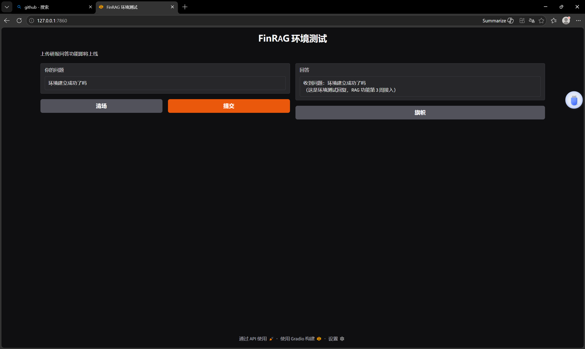

# FinRAG — 金融研报智能问答系统

基于 RAG（检索增强生成）+ Agent 的金融研报智能问答系统。
用户上传金融研报 PDF 后，可针对内容进行智能问答，支持数值推理与引用溯源，
并能调用工具查询实时股价与财务数据。

## 核心特性

- **智能问答**：基于检索内容的精准回答，从根本上抑制大模型幻觉
- **引用溯源**：每条答案标注来源研报与段落，可解释、可验证
- **Agent 工具调用**：实时股价（akshare）+ 财务数据（tushare）
- **双模式架构**：云端 API（开发）+ 本地 Ollama INT4（部署）

## 技术栈

| 类别 | 选型 |
|---|---|
| 语言 | Python 3.11 |
| 大模型 | DeepSeek / Qwen2.5-7B-Instruct（双模式） |
| 框架 | LangChain 0.3+（LCEL 语法） |
| 向量库 | ChromaDB（开发中） |
| Embedding | bge-large-zh-v1.5（开发中） |
| Reranker | bge-reranker-large（开发中） |
| Agent | LangChain Tool Calling（开发中） |
| 数据接口 | akshare / tushare（开发中） |
| 前端 | Gradio |
| 后端 | FastAPI（开发中） |
| 评估 | RAGAS（开发中） |
| 部署 | Docker（开发中） |

## 当前进展

### ✅ 已完成（第1 周）

- **Day 1-2**：项目边界 / 系统架构图 / 技术栈 / 算力方案- **Day 3-4**：环境搭建（Python 3.11 + venv + Gradio Hello World 跑通）


- **Day 5**：模型接入（DeepSeek API +第一个 LangChain Chain 跑通）
### 🚧 开发中

- **第 2 周 Day 6-7**：数据工程与知识库（PDF 解析 + 向量化 + 评测集）

### 📅 待办

- W3：RAG 核心管线（基础 RAG / Prompt / 引用溯源 / 数值推理）
- W4：Agent + 检索优化
- W5：评估 + 部署
- W6：论文 + 面试准备

## 快速开始

### 环境要求

- Python 3.10+（推荐 3.11）
- Windows / macOS / Linux

### 安装

```bash
git clone https://gitee.com/sharkmate0127/FinRAG.git
cd FinRAG
python -m venv .venv

# 激活虚拟环境
# Windows PowerShell:
.\.venv\Scripts\activate
# Windows CMD / macOS / Linux:
# source .venv/bin/activate

pip install -r requirements.txt -i https://pypi.tuna.tsinghua.edu.cn/simple
```

### 配置 API Key

在百炼/DeepSeek 平台申请 API Key，创建 `.env` 文件：

```
# DeepSeek（推荐，免费额度大）
DEEPSEEK_API_KEY=sk-你的Key

# 或 Qwen 百炼
# DASHSCOPE_API_KEY=sk-你的Key
```

### 运行

```bash
# Gradio 界面
python app_gradio.py
# 浏览器访问 http://127.0.0.1:7860

# 测试 LLM 调用
python call_qwen.py

# 测试 LangChain Chain
python chain_demo.py
```

## 目录结构

```
FinRAG/
├── README.md           # 本文件
├── requirements.txt    # Python 依赖
├── .env # 环境变量（不入 git）
├── .gitignore          # Git 忽略规则
├── app_gradio.py       # Gradio Hello World
├── test_langchain.py   # LangChain 安装验证
├── call_qwen.py        # LLM 调用测试
└── chain_demo.py       # 第一个 LangChain Chain
```

## 6 周里程碑

| 周 | 主题 | 状态 |
|---|---|---|
| W1 | 项目启动 + 环境搭建 | ✅ |
| W2 | 数据工程与知识库 | 🚧 |
| W3 | RAG 核心管线 | 📅 |
| W4 | Agent + 检索优化 | 📅 |
| W5 | 评估 + 部署 | 📅 |
| W6 | 论文 + 面试 | 📅 |

## License

MIT

